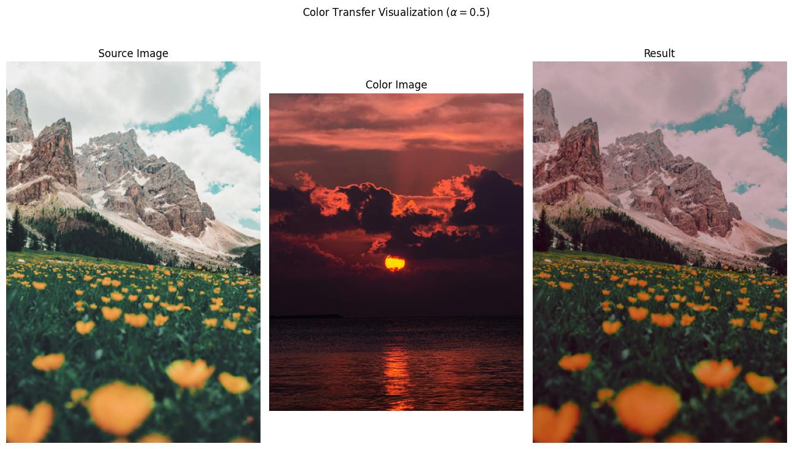

## Reinhard Color Transfer 

This repository is an implementation of ["Color transfer between images" by E. Reinhard et. al."](https://doi.org/10.1109/38.946629)

## Usage

```python
from PIL import Image
from colortransfer import transfer_color

source_image = Image.open("path/to/source/image")
color_image = Image.open("path/to/color/image")
alpha = 0.5 # Amount of color transfer
result_image: Image.Image = transfer_color(source_image, color_image, alpha)
```

Following is a visualization of result using sample images:


